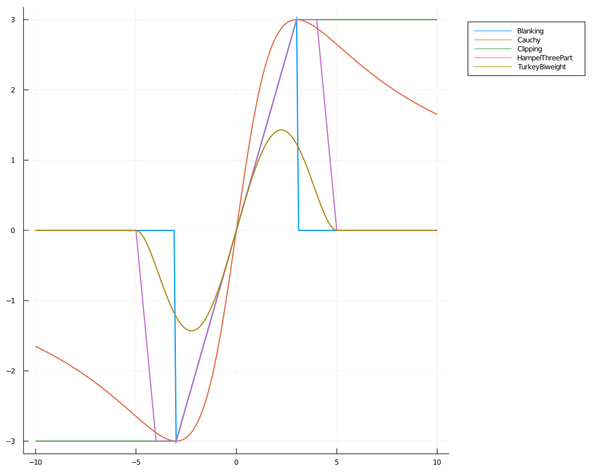

# MemorylessNonlinearities

[](https://travis-ci.com/ymtoo/MemorylessNonlinearities.jl)
[](https://codecov.io/gh/ymtoo/MemorylessNonlinearities.jl)

This package implements memoryless nonlinearity functions.

## Usage
```julia
using MemorylessNonlinearities

x = -10:0.1:10
gs = [(Blanking, 3.0),
      (Cauchy, (3.0, true)),
      (Clipping, 3.0),
      (HampelThreePart, (3.0, 4.0, 5.0)),
      (TurkeyBiweight, 5.0)]
p = plot(size=(1000, 800), legend=:outertopright)
for (g, params) in gs
    plot!(p, x, filt(g(params...), x); linewidth=2, label=string(g))
end
p
```
