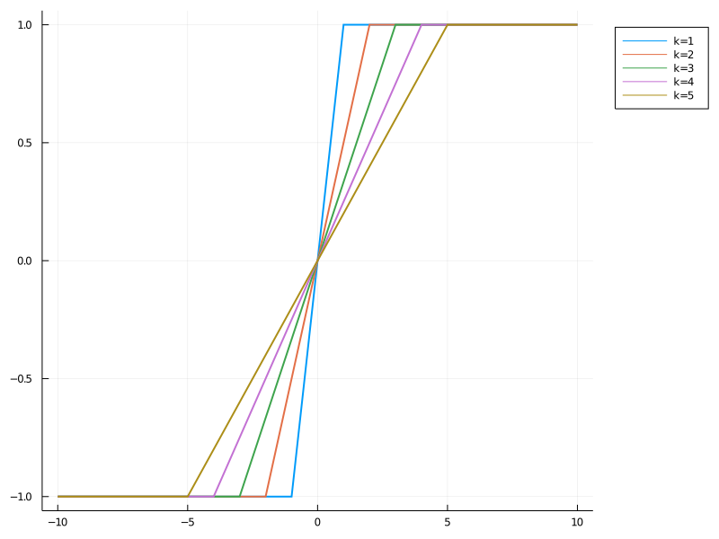
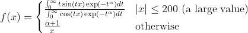

# MemorylessNonlinearities

[](https://travis-ci.com/ymtoo/MemorylessNonlinearities.jl)
[](https://codecov.io/gh/ymtoo/MemorylessNonlinearities.jl)

This package implements memoryless nonlinearity functions.

## Usage

```julia
using MemorylessNonlinearities, Plots

x = -10:0.1:10

function plotnonlinearity(x, f, params; size=(800, 600))
    p = plot(size=size, legend=:outertopright)
    for param in params
        label = join([String(name) * "=$(p)" for (name, p) in zip(
                     fieldnames(f), param)], ",")
        plot!(p, x, minmaxrescale(filt(f(param...), x), -1.0, 1.0); 
              linewidth=2, label=label)
    end
    p
end
```

### Arctangent

```julia
αs = 1:1:10
plotnonlinearity(x, Arctangent, αs)
```


### Blanking 

```julia
ks = 1:1:5
plotnonlinearity(x, Blanking, ks)
```


### CauchyNL

```julia
ks = 1:1:5
plotnonlinearity(x, CauchyNL, ks)
```


### Clipping

```julia
ks = 1:1:5
plotnonlinearity(x, Clipping, ks)
```


### HampelThreePart

```julia
abcs = ((1, 2, 3), (2, 3, 4), (3, 4, 5))
plotnonlinearity(x, HampelThreePart, abcs)
```


### SαSNL
Nonlinearity in locally optimal detectors based on IID SαS noise(approximated by 2D lookup table)

```julia
αs = 1:0.2:2
plotnonlinearity(x, SαSNL, αs)
```


### SoftClipping

```julia
ks = 1:1:5
plotnonlinearity(x, SoftClipping, ks)
```


### TurkeyBiweight

```julia
ks = 1:1:5
plotnonlinearity(x, TurkeyBiweight, ks)
```


## Performance
Chirp signals with Symmetric α-Stable noise parameterized by α=1.5, scale=1.0, location=0.0 were simulated. The following nonlinear functions were applied to the simulated data to filter the noise.
| Nonlinear       | Parameter                 |
| --------------- | ------------------------- |
| Arctangent      | α=1 
| Blanking        | k=3σ                      |
| CauchyNL        | k=3σ                      |
| Clipping        | k=σ                       |
| HampelThreePart | a=3σ,b=4σ,c=5σ            |
| SαSNL           | α=α',scale=c',location=δ' |
| SoftClipping    | k=σ                       |
| TurkeyBiweight  | k=3σ                      |

σ is median absolution deviation of the simulated data. a', c' and δ' are the estimated pararamters of IID Symmetric α-Stable distributions based on the simulated data. Root Mean Squared Errors (RMSEs) between the true chirp signals and filtered signals with respect to nonlinear functions and Generalizad Signal-to-Noise Ratios (GSNRs) are as follows. 
```julia
include("perf/simulate.jl")

E, gsnrs, gs = simulate()
plot(gsnrs, 
     dropdims(sum(E, dims=1) / size(E, 1), dims=1); 
     linewidth=2,
     label=reshape(string.(first.(gs)), 1, length(gs)),
     size=(800, 600), 
     legend=:outertopright, 
     xlabel="GSNR",
     ylabel="RMSE")
```
